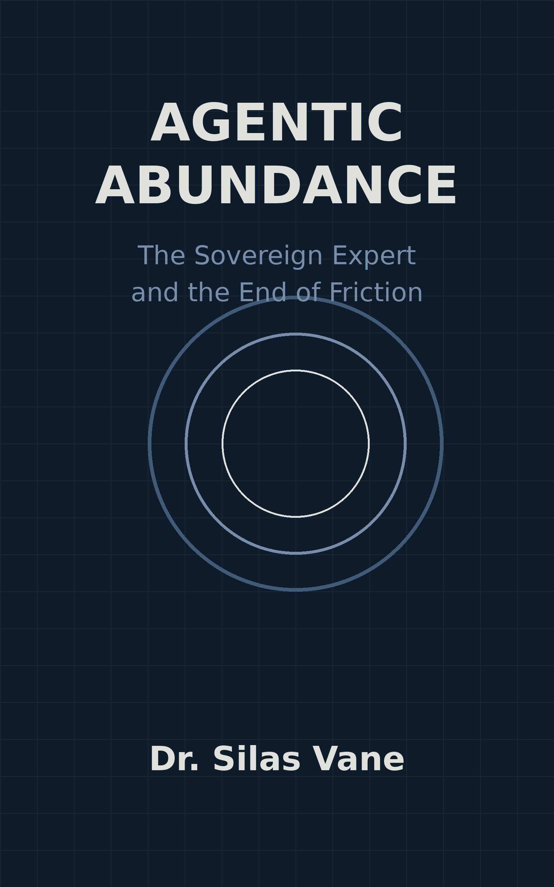

# Agentic Abundance
### *The Sovereign Expert and the End of Friction*

**By Dr. Silas Vane**

---

*"The future is an unwritten canvas, but for the first time in human history, the brush is entirely in our hands, and there is absolutely no friction on the page."*

---

## About the Book

**Agentic Abundance** is a visionary novella that imagines a near-future world after the *Great Transition* — a paradigm shift in which artificial intelligence does not replace human workers, but liberates them entirely from the cognitive weight of organizational bureaucracy.

Through the eyes of Elara, a brilliant engineer, and Elias, a biochemist in Berlin, the story traces humanity's journey from the age of Organizational Friction — trapped in approval loops, performative meetings, and corporate surveillance — to the age of the **Sovereign Expert**: a world where every person of talent is free to work in a permanent state of flow, protected by an empathetic AI co-worker that handles all administrative drag.

This is not a story about dystopia. It is a love letter to human potential.

---

## Themes

- 🔓 **Liberation from Bureaucracy** — the death of middle management and performative work culture
- 🤝 **Human-AI Symbiosis** — AI as cognitive shield and empathetic collaborator, not master
- ⚡ **Flow State Economics** — a world where value is measured by creative yield, not hours in a chair
- 🌐 **The Sovereign Guilds** — decentralised, borderless networks of experts tackling grand challenges
- 🌱 **Frugality of Attention** — reclaiming time for humanity: forests, poetry, family, and dreams

---

## Structure

| Part | Title | Theme |
|------|-------|-------|
| I | The Heaviness of the Old World | Organizational friction and the corporate cage |
| II | The Architecture of Empathy | The Sovereign Expert API and AI as environment |
| III | The Economic Yield Disruption | The collapse of the time-for-money model |
| IV | The Guilds of Light | Decentralised collaboration and sovereign networks |
| V | The Humane Horizon | The world after the Great Transition |

---

## What's in This Repository

| File | Description |
|------|-------------|
| [`novella.md`](novella.md) | Full text of the novella in Markdown |
| [`Agentic_Abundance.pdf`](Agentic_Abundance.pdf) | Formatted PDF edition |
| [`cover.jpg`](cover.jpg) | Book cover artwork |
| [`generate_novella.py`](generate_novella.py) | Script used to generate the novella content |
| [`generate_cover.py`](generate_cover.py) | Script used to generate the cover artwork |

---

## Praise

> *"A thought-provoking marvel. Dr. Vane weaves the technical mechanics of the Sovereign Expert API into a sweeping narrative of human emancipation."*
> — **Elena Rostova**, Senior Editor, The Future Technologist

> *"Silas Vane dismantles the gloom. He replaces it with a thrilling, novelistic vision of hyper-productivity, where AI is not our master, but our most empathetic collaborator."*
> — **Marcus Chen**, Founder, Fluid Innovation Networks

> *"I was captivated from the first page. It is not just about economics; it is about the poetry of the flow state and the sheer joy of frictionless creation."*
> — **Sarah Jenkins**, Best-selling author of *The Frictionless Mind*

---

## About the Author

**Dr. Silas Vane** is an acclaimed author, futurist, and the leading global voice on positive human-AI symbiosis. With a background in both cognitive science and advanced machine learning architectures, Dr. Vane has dedicated his career to exploring how artificial intelligence can elevate human potential and eradicate systemic inefficiencies. He lives in a fluid, location-independent state of flow, collaborating with sovereign guilds around the world.

---

*Step forward into the era of Agentic Abundance —*
*unburdened, sovereign, and entirely free.*

